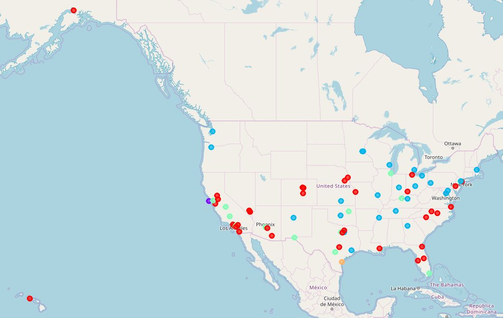
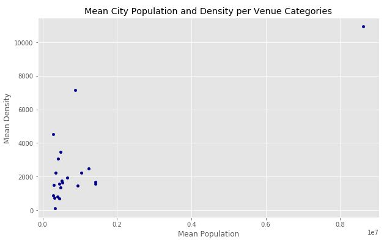
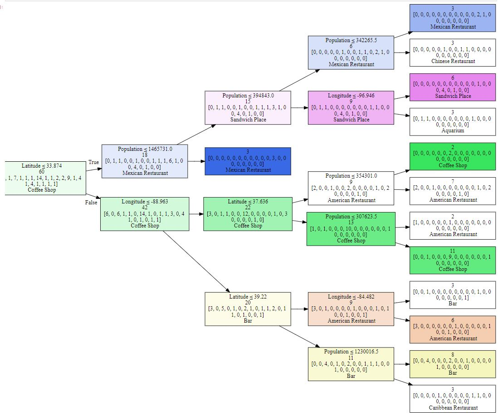
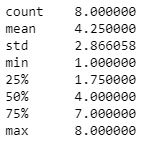

# Popular Venue Modeling

#### Michael Harreld
#### Applied Data Science Capstone Project
#### January 29, 2019

### Table of Contents
* Abstract
* 1 Introduction
* 2 Data
  * 2.1 Wikipedia City Data
  * 2.2 Foursquare Venue Data
* 3 Methodology
  * 3.1 Data Ingestion and Cleaning
    * 3.1.1 City Data
    * 3.1.2 Venue Data
  * 3.2 Data Exploration
    * 3.2.1 Clustering Cities by Top Venues
    * 3.2.2 Venue Popularity by Population and Density
  * 3.3 Venue Popularity Modeling
    * 3.3.1 Model Training
    * 3.3.2 Model Validation
* 4 Results
  * 4.1 Cities Clustered by Top Venues
  * 4.2 Venue Popularity by Population and Density
  * 4.3 Decision Tree Model for Top Venue Category
* 5 Discussion
* 6 Conclusion

## Abstract
The problem of how a developer could choose a venue to successfully develop in a city is considered.  City population, population density, and geographic locatin data is used to predict what venues would be popular based on similar cities.   K-means clustering is used to group cities by similar top venue categories.  Finally, a decision tree model is developed to predict the top venue for a city based on city data.  With some refinement, this model would be useful for choosing profitable venue types. 

## 1 Introduction

Investors and developers must choose cities and venue types that will be successful and return on their investments.
Choosing what to build in a particular city is a difficult prospect and could involve many factors.
Location data services such as Foursquare will show what current venues exist in a particular city, but they do not generally tell what venue types _should_ be popular in that city.

This project developed a model that predicts which venue types might be popular based on analyzing popular types in similar cities.
Such a model could help developers see what venue types might be popular in a particular city and whether those types are locally underrepresented.

The developer can use this information to make better project decisions and increase their return on investment.
Also, this model of venue popularity can expose trends and patterns.
For example, it may be possible to find venue types that are popular in a certain geogrphic region or city size.
Having this information can lead to better long term planning.

## 2 Data

Two data sources were used: 
* Wikipedia for city location and population data; and 
* Foursquare for city venue data.

These two data sources both use Latitude and Longitude which are used to relate them.

### 2.1 Wikipedia City Data

The web page https://en.wikipedia.org/wiki/List_of_United_States_cities_by_population contains a table with the top 311 United States cities by population.
The table includes city and state name, population data, land area, population density, and city coordinates.
Sample data for the first row is

| Column Name    | Value       |
| -----------    | -----       |
| 2017 rank      | 1           |
| City           | New York    |
| State          | New York    |
| 2017 estimate  | 8,622,698   |
| 2010 Census    | 8,175,133   |
| Change         | +5.47%      |
| 2016 land area | 301.5 sq mi |
| 2016 land area | 780.9 km2   |
| 2016 population density | 28.317/sq mi |
| 2016 population density | 10.933/km2 |
| Location | 40.6635 N 73.9387 W |

Some observations and usage decisions on this table:
* There are 2 values for population, we use the 2017 estimate and discard the 2010 value.
* We discard the Change value since it seems like it would be secondary to venue popularity.
* Both the land area and population density values are given in both imperial and metric, we discard the imperial versions.
* Since land area can be determined based on population density and population, we discard it.
* Location data is given as a string and within the table data includes both the decimal and minutes-seconds formats - we extract the decimal form only and separate out the latitude and longitude values.
* Overall, the data in the table is messy and includes superscripts, units, and other noise that must be cleaned.

After all of the cleanup we are left with the following data as candidates to our data model:
City, State, Population, Population Density, Latitude, and Longitude.

### 2.2 Foursquare Venue Data

The Foursquare web site provides many APIs for interacting with city location data.
The API we use is venue search and is documented at https://developer.foursquare.com/docs/api/venues/search
The API takes a location as an input and returns a list of venues close to that location.
Each returned venue contains a name, address info, location, and a venue category.
A venue category could be, for example, Mexican Restaurant or Bank.
We used the Foursquare venue data to determine the frequencies of various venue categories within a particular city.
The returned data is in json format and relevant values are extracted and structured.

## 3 Methodology

A Jupyter Notebook [PopVenueModel.ipynb](PopVenueModel.ipynb) running a python kernel was used to gather, sanitize, explore, model, and visualize data.  The primary libraries imported and used in the notebook were:
* **Pandas** : Data analysis tools
* **NumPy** : Array handling
* **Requests** : HTTP client
* **Folium** : Map visualization
* **Matplotlib** : 2D Plotting
* **scikit-learn** : Machine learning
* **Graphviz** : Graph visualization

Data was brought in by accessing the city wikipedia table and the Foursquare venues API.  It was processed and cleaned so the two data sets could be merged into one.  Exploration was done by k-means clustering, statistical analysis, scatter plots, and geographic mapping.  A decision tree model was trained and validated to predict popular venues based on city data.

### 3.1 Data Ingestion and Cleaning
Data was directly accessed from the wiki web page and the Foursquare API and cleaned.  Pandas and other python libraries were used to clean the data.

#### 3.1.1 City Data
The large table from https://en.wikipedia.org/wiki/List_of_United_States_cities_by_population was brought into the notebook using pandas and further processed.  Looking at the native columns it was noted that
* Rank was effectively redundant to the population;
* 2010 population data was not needed because there was newer 2017 data;
* Change data was probably second order and could be ignored;
* Land area columns were derivable from population and population density; and
* Imperial unit values were derivable from the metric ones.

Based on this analysis, the columns 
* 2017 Rank
* 2010 Census
* Change
* 2016 land area imperial
* 2016 land area metric
* 2016 population density imperial

were dropped as irrelevant.

Looking at the remaining column data the following issues were identified:
* City data had superscript values that needed to be removed
* Density data had embedded units that needed to be removed
* Density data had commas that needed to be removed
* Location had two values per field - needed to throw away the minutes-seconds data and keep the decimal version

The data was cleaned by addressing each of these issues.

The Location field had complex structured data such as *40.6635°N 73.9387°W* which could not be easily analyzed.  Functions were written to extract out the individual latitude and longitude values and these were introduced as 2 new columns replacing the structured Location column.

All columns were cast to the correct type so that numerics could be analyzed.

After cleanup the city data consisted of the following columns: City, State, Population, Density, Latitude, and	Longitude.

#### 3.1.2 Venue Data
The 75 largest cities were separated from the city data to be the primary data set.  For each of these cities, the Foursquare venue search API was accessed to search for the 50 closest venues to the city's known latitude and longitude and within a 500 meter radius.  The range and count venue limits were applied based on the Foursquare account policy limits.

Each request had a response of structured JSON data.  The following four values from each venue result were extracted from the JSON:
* Venue
* Venue Latitude
* Venue Longitude
* Venue Category

These columns were joined with City Name, City Latitude, and City Longitude data into a large dataframe.

### 3.2 Data Exploration

The gathered data was explored and visualized to gain insight into candidate independent variables that might predict the target variable of popular venue category.  To see if location data was a viable independent variable, the cities were clustered using the k-means algorithm to see if the clusters had a location pattern.  To explore whether population and density variables might be useful a scatter plot was created to graph top venue type by mean population and mean population density. 

#### 3.2.1 Clustering Cities by Top Venues

The location and venue data was explored to give insight into whether location data was likely to be a predictive factor of top venue categories for a city.  Cities were clustered using the k-means clustering algorithm into 5 groups based on similarity between top venues.  These clusters were graphed on a map and also displayed in tables.  

A one-hot table was created for the venue data so that each venue category became a dedicated column with a value of 1 only if the venue was that particular category, 0 otherwise.  This one-hot table was then grouped by City applying a mean for each one-hot column.  This grouped table thus contained the fractional occurence of each venue category within each city.

The K-means clustering algorithm was applied to the top 10 venue categories to find 5 clusters of cities grouped by most similar rankings.  The category value of each city was merged with its location data in preparation for graphing.  A map of the United States was created with each of the 75 considered cities marked with using a color coded by category.  Each of the 5 categories was also examined by table to see rough patterns in the top venues. 

#### 3.2.2 Venue Popularity by Population and Density

Population and population density data was explored to see if this data might be a factor in predicting top city venue categories.  The mean population and density for each of the top city categories was calculated 

A new dataframe was created containing the number one venue category of each city along with its population and density.  
This data was grouped by category and the mean of population and population density for each category was calculated.  
Each category was then added as a dot in a scatter plot with mean population as the x-axis and mean population density as the y-axis.
Examining this plot gave insight into the range and clustering of population and density to determine if they were predictive candidates (spread out values) or not (centralized values).

### 3.3 Venue Popularity Modeling

After the data was explored it was determined that all four of the considered variables: Population, Population Density, Latitude, and Longitude were feasible candidates as independent variables.  All four of these are numeric values.  The target variable was top venue category, which is a categorical variable.  Since the output of the model was categorical, a decision tree model was used.  To check the validity of a trained decision tree, 20% of the data was held back for testing purposes.

#### 3.3.1 Model Training

The decision tree was trained using the scikit-learn DecisionTreeClassifier.  This purpose of the classifier is to consturct a tree of simple tests on the independent variables that will ultimately lead to an endpoint containing the predicted classification of the target variable.  Details on the underlying algorithm are at https://scikit-learn.org/stable/modules/tree.html  

The training was done using 80% of the 75 cities (60).  The tree was constructed to a depth of 4.  After construction of the tree, it was visualized as a flow graph with true or false branches on a condition at each node as well as a best-guess venue category.

#### 3.3.2 Model Validation

For validation, 20% of the 75 cities (15) were held back from training.  Each of these 15 cities had their population, population density, and location information put into the trained model to output a predicted venue category.  The actual top ten venue categories for each of the cities was then used to determine the accuracy of the prediction.  The number of predictions occuring in the top 10 actuals was calculated.  For the predictions that were found in the top 10 actuals, analysis on the actual rankied postion was performed to calculate mean, standard deviation, range, and quartile statistics. 

## 4 Results

### 4.1 Cities Clustered by Top Venues

The five clusters color coded to their city locations appears as follows:

Some geographic correlation can be seen in this map where top categories appear to have some rough patterns.
Looking directly at the tabular data for top 10 venue categories per city within each cluster, we can also see other rough patterns.

Summarizing, the following observations were made for the five categories:

| Category | Color | Geographic Pattern | Venue Pattern |
| -------- | ----- | ------------------ | ------------- |
| 0 | Red | Coastal/Midwest | Diverse Restaurants and Coffee Shops |
| 1 | Purple | San Francisco Only | Harbor related |
| 2 | Blue | North east trend | Bars |
| 3 | Green | South/Midwest | Mexican Restaurants |
| 4 | Orange | Corpus Christi only | Resort related |

map-seems like some correlation - e.g. red and green coastal and midwest, blue tending towards north east, purple san francisco only, orange corpus cristi only
red (0) diverse restaurants and coffe shops
purple(1) san fran harbor related venues
blue(2) bars
green(3) mexican restaurants
orange(4) corpus christi resort related venues

### 4.2 Venue Popularity by Population and Density

Mean City Population and Density were graphed for each venue category as follows:

There is a large range and distribution of both population and population density means across the categories.

The venue category with the maximum for both mean population and density is the *Caribbean Restaurant*.
Cities with top venue category *Portuguese Restaurant* have the minimum mean population.
*Discount Store* is the top venue category having the minimum population density

### 4.3 Decision Tree Model for Top Venue Category

The trained decision tree model had the following branching structure:

Each node shows the current best-guess category at that stage, the number of training data points that flow through that node, the classification question for the next stage.  Edges go to the next stage up if the answer to the classification question was true and down if it was false.

The classification questions can be made easier to understand by comparing them to actual cities.  For example, looking at the first few stages, we can see that the best guess given no information is that a city's top venue is *Coffee Shop*.  From that point, if the city is south of Long Beach CA the guess would change to *Mexican Restaurant*  From that node if the city were smaller than San Antonio TX the best guess would change to *Sandwich Place*

For verification, the held back 15 cities were run through the model.  It was found that the model was able to predict the category within the top ten actuals in 8 out of 15 cities.

For the 8 cities where the prediction matched one of the top 10 actual ranked venues, the ranked value of the match was statistically analyzed as follows:

## 5 Discussion

A model was successfully created that had some success in predicting popular venues based on city population, density, and geographic location data.  While overall the approach appears sound, there were some limitations encountered that degraded the quality of the model.  These issues could likely be addressed in iterative stages.

The Foursquare account used had limiting policies that kept the city count at 75 and the venues per city at 50.  This greatly limited the venues to only those found in the city center without sampling the entire city.  Due to this there was observed bias found in the data for example the cluster containing only San Francisco being skewed towards harbor related venues while the one containing only Corpus Christi was skewed towards resort related venues.  Other cities could similarly be seen to have an overrepresentation of venues occuring at the center of down town.  Using an unlimited Foursquare account would allow the range and venue count to cover the entire city and give much more representative data for the venues that city contained.  We would expect better model results overall given this data.

The clustering algorithm defined closeness based on equivalent venue categories between cities in a particular rank.  For example, two cities would have more 'closeness' for clustering if they both had *Bar* in the 3rd ranked position.  They would not be considered any closer, however, if one had *Bar* in rank 2 and the other had it in rank 3.  This makes the closeness measure more brittle and could be improved so that closeness was granted when the same category appeared between cities in any rank.  It might be further refined to give more closeness if the ranks were nearer.  Having a refined closeness algorithm would yield better clustering and likely give greater insight into the city trends.

Most of the venue categories were restaurants, however there were other categories analyzed.  It was difficult to see patterns in the non restaurants, however, because that data was in the noise of the restaurant data.  If better insight was desired in the non restaurant venues, it would be worthwhile to repeat the analysis separately for each classification of categories.  This would allow better understanding, for example, into where museums are popular.

## 6 Conclusion

Using the decision tree model and other results, it is possible to make recommendations on likely popular venue categories for a particular city based on population, population density, and geographic location.  We can imagine, however, a developer intending to develop a venue in a city using this model to see what kinds of venues might be popular.  The predicted popularity could be compared to actual venue occurence to find gaps in actual venues.  Identifying a likely popular venue that does not yet occur in a particular presents an opportunity for successful development and high return on investment.

While the preliminary results are promising, limitations in the available data and tools hampered the ability to construct robust models.  Acquiring more data and refining our models further would likely make this approach more powerful.  With further refinement, this approach could definitely be used to guide developers and investors into profitable ventures.
